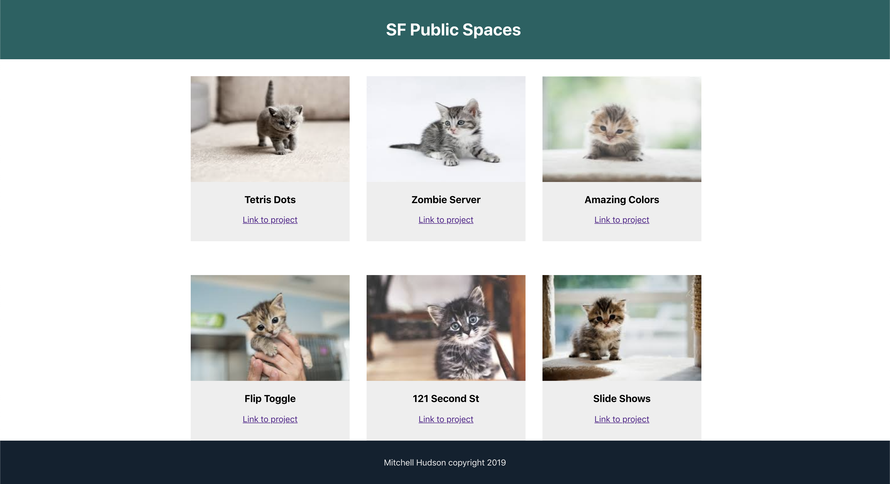

The goal of this tutorial is to learn the foundational concepts of React by building a web site using React. This tutorial will keep things simple and focus on only a few core concepts. Future lessons will build on these concepts.

By the end of this tutorial, you'll have a react site that looks similar to the following (replacing the adorable kittens with images of your choosing):



Besides using this tutorial to create a Website with React, you can use this as a guide to get started with future React projects.

# Learning Outcomes

By the end of this tutorial, you should be able to...

1. Understand how to set up a React project
1. Create basic React components

# Create React App

Let's get started by creating a new React App! Here you are installing the react starter project from the React Team at Facebook:

> [action]
>
> Navigate to a location on your computer where you want the project to live and replace `<name>` below with the name of your project.
>
```bash
npx create-react-app <name>
```

While you can install React manually, the boilerplate code installed by `create-react-app` is comprehensive and up to date. Use this whenever possible.

> [info]
>
> **Note!** If you're having errors installing Create React App, it could be a problem with the version of Node.js that is installed. Try installing [nvm](https://github.com/nvm-sh/nvm#installation-and-update) (Node Version Manager).
>
> Use nvm to install a specific version of node: `nvm install <0.0.0>`
>
> For example, `nvm install 10.16` installs node 10.16 which was the latest version of Node at the time this was written
>
> Use nvm to select and use the a specific version of node: `nvm use 10.16` uses Node version 10.16.

# Run Your App

> [action]
>
> Run your app! Navigate to the react project folder and the following command:
>
```bash
npm start
```

After starting up your app should be running at [http://localhost:3000/](http://localhost:3000/)

Here you are running some background services that bundle your app. React apps are written with the ES6 version of JavaScript along with JSX an extension of the JS language. This code does not run in the browser it needs to be transpiled to vanilla ES5 version of JS first.

The command also starts a local server that hosts your project, watches for changes to files in the project folder and relaunches the server when changes occur.

# Explore The App

Explore the project. Create React generates many files and arranges them in directories:

- `node_modules`
- `public`
- `.gitignore`
- `package.json`
- `README.md`

**You will do all of your work in the src directory.** The other files and folders you can ignore for now.

`README.md` contains reference info about create react app. Look here for reminders about the npm commands used with create-react-app.

Take a look in `src`:

- `src`
  - `App.css`
  - `App.js`
  - `App.test.js`
  - `index.css`
  - `index.js`
  - `logo.svg`
  - `serviceWorker.js`

These are the files that make up the app. Running the default project you should see a web page that is generated at `index.js`. Think of this as the entry point of the app. You don't ever need to edit this file.

React Projects are built from Components. This default project has one Component: `App` which defined in the file `App.js`. This Component generates everything you are seeing in the browser.

Take a look at `index.js`. You'll see that this file imports `App.js` at the top of the page:

`import App from './App';`

Further down the code you'll that the `App` Component is used here:

`ReactDOM.render(<App />, document.getElementById('root'));`

This is the top level component. While `App` is a single component all the components it contains will be rendered.

Take a look at `App.js` to see what it renders.

In `App.js` you'll see a single function that returns a block of what appears to be HTML. Notice the HTML is not a string. This is **JSX**.

> [info]
>
> JSX is an extension of the JS language. JSX is transpiled into plain JS before the App is run. This transpiling process is handled by Webpack and it is why you build and run the app from the command line.


# Using Git/GitHub

Much like we've done in earlier tutorials, make sure you're committing your code as you complete milestones. At a minimum, you should make a commit whenever the tutorial prompts you.

# Set Up Git/GitHub

Set up your repo!

>[action]
> Make your first commit
>
```bash
$ git init
$ git add .
$ git commit -m 'project init'
```

Now Go to GitHub and create a public repository called `REPO-NAME`, and now associate it as a remote for your local git project and then push to it.

>[action]
> Push it!
>
```bash
$ git remote add origin GITHUB-REPO-URL
$ git push origin master -u
```
