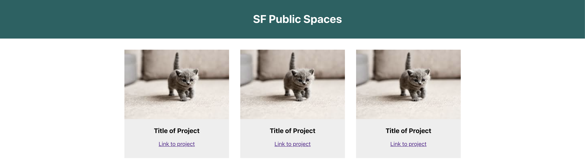

Now we'll create a content container component. This is where we'll store our awesome content, which in this case, could be adorable kitten images!

> [action]
>
> Make a new file: `src/PageContent.js` and add the following code to it:
>
```js
import React from 'react'
>
function PageContent() {
  return (
    <div>
      <h2>Content here...</h2>
    </div>
  )
}
>
export default PageContent
```

Import this file and use the new Component in `App.js`

> [action]
>
> Add the following to the top of `App.js`:
>
>`import PageContent from './PageContent'`
>
> Then use the new Component:
>
```js
function App() {
  return (
    <div className="App">
      <PageHeader />
      <PageContent />
    </div>
  );
}
```

React uses a Component Architecture. Notice here how one component can contain another component and the App is built from many components each designed to display a single UI element.

# Adding Content To The Container

So we have an empty container, now we need to add content to it. Here the goal is to display a list of your projects in the content page. Each project will use the same component but will eventually display different information for each project.

For now imagine each project has the following elements:

- Image
- Title
- Link

Let's make a component to show a project.

> [action]
>
> Make a new file: `src/Project.js` and add the following code to it:
>
```js
import React from 'react'
>
function Project() {
  return (
    <div>
      
      <h3>Title of Project</h3>
      <a href="#">Link to project</a>
    </div>
  )
}
>
export default Project
```

Now we can import and add a few Projects to your Content Page.

> [action]
>
> In `PageContent.js` add import Project:
>
`import Project from './Project'`
>
> Then add a few Projects:
>
```js
function PageContent() {
  return (
    <div>
      <Project />
      <Project />
      <Project />
      <Project />
      <Project />
      <Project />
    </div>
  )
}
```

This should now show a list of 6 projects in PageContent which is displayed in the App.

While this is working, it's less than ideal since all of the projects has the same title, image src, and link url. You will address this in the coming steps.

Components can be reused and nested. You've used the `Project` component 6 times here. Each is a separate and unique instance of `Project.js`.

All of these components are wrapped up in the `PageContent` which is rendered by the `App` component.

# Add some Local Image Files

We have these projects, but there's no images attached to them. In order to create an images folder. This will need to be placed in the `public` folder. Your React project is run from the `public` folder after the source files are transpiled.

Images and other static files that your project will use must be referenced with the public directory as the root.

> [action]
>
> First let's make a new folder: `public/images/`
>
> Now find a couple images and place them in this folder.

Now we can reference an image from your `Project` component.

> [action]
>
> Do this by updating the project component with a path to one of your images.
>
```js
function Project() {
  return (
    <div>
      // replace kitten-0.jpeg with your image
      
      <h3>Title of Project</h3>
      <a href="#">Link to project</a>
    </div>
  )
}
```

Your website should now look something similar to the following:



Static files must either be imported into a component or stored in the `public` folder. The code you write in the `src` folder is not used directly. It is transpiled and the resulting bundle is run from the `public` folder.

This is great if you want to have purely static components, but let's aim a little higher...

# Making Dynamic Components with Props

Components can be made dynamic by using props. **Props** are values (think properties) that are passed into the Component from outside.

Above you created a list of `<Project />` component instances each of which displays exactly the same thing. The goal of this step is to make this component dynamic by adding props. _This will allow each instance to be configured differently._

Props is always an Object with properties. All of the values that you want to pass into a component will be attached to this Object.

In the case of the `Project` Component there are three things that need to be dynamic:

- title
- image url
- link url

> [action]
>
> You'll need to define a key on the props object for each of these values. Do this in `Project.js` by making these changes:
>
```js
function Project(props) {
  return (
    <div>
      
      <h3>{props.title}</h3>
      <a href={props.link}>Link to project</a>
    </div>
  )
}
```

Notice when using JavaScript expressions in a JSX block you must wrap the expression in `{` and `}`. You see this here with `src`, the text content of the `<h3>`, and `href`. If the value is a string just use the quotation marks.

> [info]
>
> You can also deconstruct the function this way, if you like:
>
```js
function Project({ image, title, link }) {
  return (
    <div>
      
      <h3>{title}</h3>
      <a href={link}>Link to project</a>
    </div>
  )
}
```

Next, you need to assign values to each of the properties on the props object. Do this where instances of the Project component are created.

Each property assigned to props is set as an attribute in the JSX declaration.

> [action]
>
> In `PageContent.js` make the following changes substituting `title` and `image` for your appropriate text/image paths:
>
```js
function PageContent() {
  return (
    <div>
      <Project title="Tetris Dots" image="/images/kitten-0.jpeg" link="#" />
      <Project title="Zombie Server" image="/images/kitten-1.jpeg" link="#" />
      <Project title="Amazing Colors" image="/images/kitten-2.jpeg" link="#" />
      <Project title="Flip Toggle" image="/images/kitten-3.jpeg" link="#" />
      <Project title="121 Second St" image="/images/kitten-4.jpeg" link="#" />
      <Project title="Slide Shows" image="/images/kitten-5.jpeg" link="#" />
    </div>
  )
}
```

The attribute name needs to match the name of the key on the props object, `title`, `link`, and `image` in this case.

You now have a single Project Component which you can use as often as you like, and each instance can display any title, image, and link url. _This is the power of props_. Use Props to configure your components.

You can assign props as key value pairs defined in JSX like attributes in HTML. For example: <MyComp message="Hello World" value={42} />`

You can get props inside a component from the props object which is passed as a parameter, like so:

```js
function MyComp(props) {
  <div>
    <h1>{props.message}</h1> // Hello World
    <p>{props.value}</p> // 42
  </div>
}
```

JS expression inside JSX must be placed in the `{}`. For example: `<PI value={22/7} />`

Now you should see all sorts of kittens (or other images) on your page! In this last chapter, we'll build out this page a bit more to give it some finesse.
