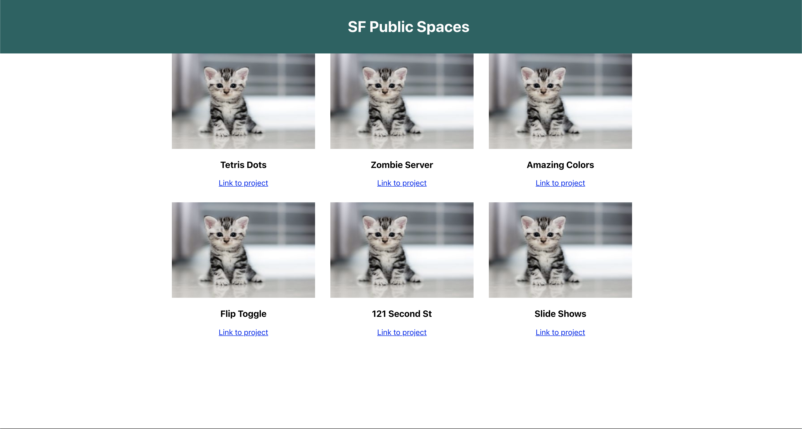

Think of the page you created. It is built from Components. The Components are like Lego bricks, you can mix and match and reuse them to build a larger structure/system.

When you edit your project you need only be concerned with the one component or the interaction between two components. In other words you'll often only be concerned with one or two components at a time while you work.

In this page `App` is the top level component. It displays the `PageHeader` and `PageContent` components. The `PageContent` Component displays a list of `Project` components.

To make changes to your project you'll need to think about which component is responsible for the area that you want to edit. You'll make the changes in the file that defines that component.

It would be really nice if the projects were arranged in a grid. Let's do this by adding styles to the `PageContent` component. Remember, the `PageContent` component displays the `Project` components.

> [action]
>
> Add a new css file: `src/PageContent.css`, and add the following code to it:
>
```css
/* src/PageContent.css */
>
.PageContent {
  width: 960px;
  margin: auto;
  display: grid;
  grid-template-columns: 1fr 1fr 1fr;
  grid-gap: 2em;
}
```
>
> Next, Import this stylesheet into `src/PageContent.js`:
>
`import './PageContent.css'`
>
> Then add the class name to `src/PageContent.js`:
>
```js
// src/PageContent.js
>
import './PageContent.css';
>
...
>
function PageContent() {
  return (
    <div className="PageContent">
      // Rest of Project Components
      ...
  )
}
>
...
```

Your page should now look something similar to this (with different pictures and titles):



React is a library for creating user interfaces. Components represent UI elements. Understanding your React projects is about understanding which component is responsible for which part of the UI.

# Thinking in Components Pt. 2

Style the `Project` component. Add a style sheet and some styles to it.

> [action]
>
> Follow these steps on your own.
>
> - Make a new stylesheet: Create a new CSS file in the `src` directory named `Project.css`
> - Import the stylesheet: import the new CSS file into `Project.js`
> - Add some styles: add some styles to the stylesheet
> - Add some class names: Add a class name to elements in the `Project` component that you can target with your styles

# Making New Components

Your page needs a footer!

> [action]
>
> Add a Footer Component! Do this on your own following the steps used previously. Keep the footer simple for now. Keep the content simple in the footer for now. Imagine it only needs to display your name and copyright with the year. For example:
>
> `Mitchell Hudson copyright 2019`
>
> - Make a new file for the new Component in `src` called `Footer.js`
> - Define the footer in this file. Remember to export the footer as default
> - Import the Footer Component into `App.js` and render it

Next let's style your Footer:

> [action]
>
> - Add a class name to elements in Footer
> - Make a new file in `src` called `Footer.css`
> - Add styles to this file and style elements in Footer
> - Import the Footer Styles

Your site should look very similar to the finished product you saw in the first chapter.

# Feedback and Review - 2 minutes

**We promise this won't take longer than 2 minutes!**

Please take a moment to rate your understanding of the learning outcomes from this tutorial, and how we can improve it via our [tutorial feedback form](https://forms.gle/2yApCdKchE5WkNKD6)

This allows us to get feedback on how well the students are grasping the learning outcomes, and tells us where we can improve the tutorial experience.

# Now Commit

>[action]
>
```bash
$ git add .
$ git commit -m 'dynamic content and footer'
$ git push
```

**Congrats on building your React page!**

# Stretch Challenges

Looking for more? Try these out:

> [challenge]
>
> - Display the year in the footer by getting the year via JS using the Date Object
> - Add a Like Count to each project. This will be a prop that is a number.
> - Display the Like count in the Project Component.
