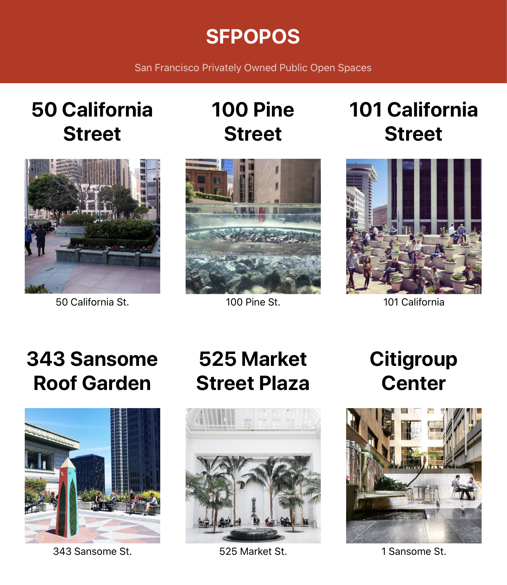

Think of the page you created. It is built from Components. The Components are like Lego bricks, you can mix and match and reuse them to build a larger structure/system.

When you edit your project you need only be concerned with the one component or the interaction between two components. In other words, you'll often only be concerned with one or two components at a time while you work.

**It's important to create a clear mental model of the components used in your project.** Using good naming conventions will help you. 

In this page `App` is the top-level component. It displays the `Title` and `POPOSList` components. The `POPOSList` Component displays a list of `POPOSSpace` components.

To make changes to your project you'll need to think about which component is responsible for the area that you want to edit. You'll make the changes in the file that defines that component.

## Arranging Spaces in a Grid

It would be nice if the projects were arranged in a grid. 

CSS Grid is a set of CSS properties made for arranging elements in rows and columns. When declare an element `display: grid` that element arranges all of children in a grid. 

In your case `POPOSList` is the parent and the `POPOSSpace`s are the children.

As you saw earlier the React way to handle styles is to create a stylesheet for each component and name that stylesheet with the same name as the component it styles. 

Be sure to give the top level element in that component a class name that matches it's name. This will help us remember what styles apply to what, and keep us from using the same names in different files. 

Add a new stylesheet. 

> [action]
>
> Add a new css file: `src/POPOSList.css`, and add the following code to it:
>
```css
/* src/POPOSList.css */
>
.POPOSList {
  width: calc(100% - 80px);
  margin: auto;
  display: grid;
  grid-template-columns: 1fr 1fr 1fr;
  grid-gap: 40px;
}
```

Here you calculated the width of this element to 100% the width of the container less 80px. With margin set to auto the browser will make the margins equal on both sides. You should now have 40px margins on the left and the right. 

To display the the spaces in a grid you defined the display as grid. Then gave the grid three template columns. Each column is 1fr. An fr is a unit that represent a fraction of the space available. Last you set the gap between columns to 40px. 

>
> Next, Import this stylesheet into `src/POPOSList.js`:
>
`import './POPOSList.css'`
>
> Then add the class name to `src/POPOSList.js`:
>
```js
// src/POPOSList.js
>
import './POPOSList.css';
>
...
>
function POPOSList() {
  return (
    <div className="POPOSList"> // <- add the class name here! 
      ...
  )
}
>
...
```

Your page should now look something similar to this (with different pictures and titles):


React is a library for creating user interfaces. Components represent UI elements. Understanding your React projects is about understanding which component is responsible for which part of the UI. Here `POPOSList` is responsible for rendering it's children. 

# Thinking in Components Pt. 2

Next style the Spaces by adding a stylesheet for the `POPOSSpace` component. 

Add a new stylesheet. 

> [action]
>
> Follow these steps on your own.
>
> - Make a new stylesheet: Create a new CSS file in the `src` directory named `POPOSSpace.css`
> - Import the stylesheet: import the new CSS file into `POPOSSpace.js`
> - Add some styles: add some styles to the stylesheet
> - Add some class names: Add a class name to elements in the `POPOSSpace` component that you can target with your styles

Using the same name for everything might seem odd at first. It keeps the spelling errors down and makes it easier to reason about your work since there are fewer names to remember. 

Here are some styles for `POPOSSpace.css`

```CSS
.POPOSSpace {
  width: 100%;
}

.POPOSSpace > img {
  width: 100%;
  height: auto;
}
```

These styles start to make our page repsonsive. 

The first rule makes each `div.POPOSSpace` expand to the width of it's grid cell. The width of the grid container is a percentage of the window width so these cells expand and contract with the window. 

The second rule sets the width `img` tags within the `div.POPOSSpace` to 100% of the available space. With this the images match the width of their container. The second property here `height: auto` makes images maintain their aspect ratio as they scale. 

The page should look something like this at this point. 



# Making New Components

This page needs a footer.

> [action]
>
> Add a Footer Component! Do this on your own following the steps used previously. Keep the footer simple for now. Keep the content simple in the footer for now. Imagine it only needs to display your name and copyright with the year. For example:
>
> `Mitchell Hudson copyright 2019`
>
> - Make a new file for the new Component in `src` called `Footer.js`
> - Define the footer in this file. Remember to export the footer as default
> - Import the Footer Component into `App.js` and render it

Next, let's style your Footer:

> [action]
>
> - Add a class name to elements in Footer
> - Make a new file in `src` called `Footer.css`
> - Add styles to this file and style elements in Footer
> - Import the Footer Styles

Your site should look very similar to the finished product you saw in the first chapter.

## Organizing Code

As your project grows the number of files grows. The `src` directory is getting pretty crowded. A good idea now might be to organize your code into folders. 

All of your code must remain in the `src` directory. You can make folders and sub-folders within `src` to organize your work. 

Since you have been writing components in a JS file along with sibling CSS file you can organize these together in a folder. 

**You will need to include a path to files when you import them. Moving a file will mean that you may need to change the import state in another file!**


# Now Commit

>[action]
>
```bash
$ git add .
$ git commit -m 'dynamic content and footer'
$ git push
```

**Congrats on building your React page!**

# Stretch Challenges

Looking for more? Try these out:

> [challenge]
>
> - Display the year in the footer by getting the year via JS using the Date Object
> - Add a Like Count to each project. This will be a prop that is a number.
> - Display the Like count in the Project Component.
